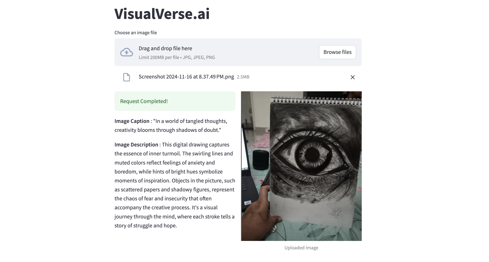

# VisualVerse.ai

## Table of Contents
- [VisualVerse.ai](#visualverseai)
  - [Table of Contents](#table-of-contents)
  - [Overview](#overview)
    - [What problem does it solve?](#what-problem-does-it-solve)
    - [Who is it for?](#who-is-it-for)
    - [What inspired the project?](#what-inspired-the-project)
  - [Features](#features)
    - [Sample Results](#sample-results)
  - [Tech Stack](#tech-stack)
  - [Installation](#installation)
  - [Project Structure](#project-structure)
  - [Acknowledgements](#acknowledgements)


## Overview
**VisualVerse.ai** is an innovative tool designed to generate captions and descriptions specifically for art images. The platform focuses on understanding and conveying the emotional depth and type of art, enabling users to create meaningful captions for any form of art—be it photography, paintings, or digital art. It also offers diverse perspectives on the interpretation of unknown art pieces, enhancing appreciation and understanding.

### What problem does it solve?
VisualVerse.ai addresses the challenge many art enthusiasts and photographers face: crafting compelling captions that capture the essence of their art. It helps streamline the process of sharing artwork on social media by providing quick, AI-generated captions, making it easier to express the nuances of the piece. Additionally, it serves as an educational tool for understanding and interpreting various art forms with different perspectives.

### Who is it for?
The project is aimed at:
- **Photographers and artists** who want to quickly generate meaningful captions for their work.
- **Art lovers** looking to gain insights or understand the meaning behind various artworks.
- **Social media users** who wish to enhance their posts with expressive captions effortlessly.

### What inspired the project?
VisualVerse.ai was inspired by the need to simplify the process of creating captions for art pieces. For those who love creating and sharing art but find it challenging to put their thoughts into words, this tool merges technology and creativity to make caption generation both efficient and expressive.


## Features

- Generates captions and short descriptions for photos.
- Considers the art type and emotion of the image.

### Sample Results
Below are some examples showcasing the results generated by **VisualVerse.ai**:

**Sample Result 1**


**Sample Result 2**


**Sample Result 3**


## Tech Stack
The main technologies used in this project include:

- **Frontend**: [Streamlit](https://streamlit.io/) for building an interactive and user-friendly interface.
- **Backend**: [FastAPI](https://fastapi.tiangolo.com/) for handling API requests and serving the application.
- **Machine Learning Models**:
  - **[CLIP Model by OpenAI](https://openai.com/research/clip)**: Used for understanding and analyzing the content of images.
  - **GPT-4o-mini**: Used for generating captions and descriptions based on the analyzed data.


## Installation
Explain how to set up the project locally:
```bash
# Clone the repository
git clone https://github.com/Shubby98/VisualVerse.ai.git

# Navigate to the project directory
cd VisualVerse.ai/


# Create virtual env (for linux/unix system)
python3 -m venv .env

#activate the virtual env
source .env/bin/activate

# install dependecies
pip install -r requirements.txt

# Start the streamlit server
streamlit run stream.py

#start the backend server
# activate the virtual env in new terminal 
cd VisualVerse.ai/src
python3 app.py


Note - enter your openai key in config.json file
```


## Project Structure

```
project-name/
├── img/
├── src/
│   ├── sample_img/
│   ├── caption_generator.py
│   ├── art_emotion_description.py
│   ├── config.json
│   └── app.py
│
├── stream.py
├── requirements.txt
├── .gitignore
├── LICENSE
└── README.md
```

## Acknowledgements
- **Instagram Contributions**:
  - Photos used in this project were sourced from my Instagram: [@hi.shubham.shakya](https://www.instagram.com/hi.shubham.shakya/)
  - Additional photos were provided by my friend: [@artify_nik](https://www.instagram.com/artify_nik/),  [@omjangid1](https://www.instagram.com/omjangid1/)
- **Contributors**: This project was created during the **UB Hackathon 2024** with the collaboration of my amazing teammates:
  - [Praanav Bhowmik](https://github.com/PraanavBhowmik15) 
  - [Vaibhav Sharma](https://github.com/vaibhaaavvv)